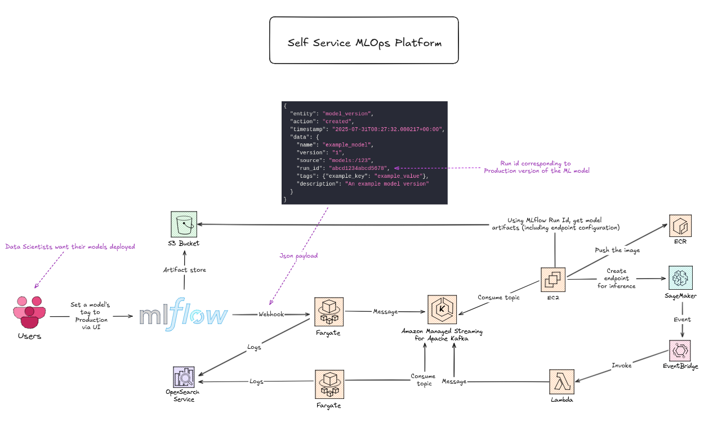
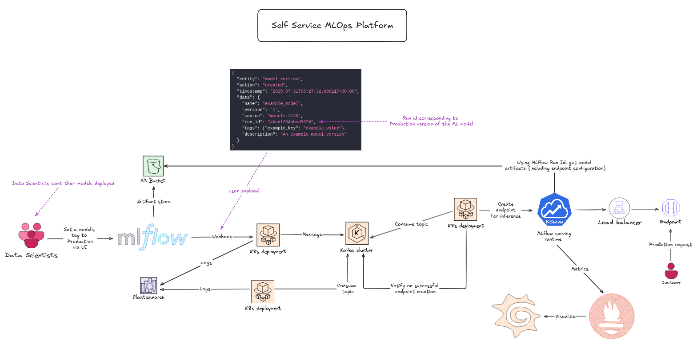

# Self service MLOps platform

In this project, I will build a self-service MLOps platform that enables data scientists to seamlessly deploy their machine-learning models for inference. The design below demonstrates how this can be achieved using AWS services; in practice, I will implement the solution with open-source technologies that provide equivalent capabilities.

Platform created via AWS services



Equivalent platform via open source tools and technologies



### Deploy managed kubernetes cluster

```bash
cd terraform/k8s
terraform init
terraform apply --auto-approve
```

### Deploy helm charts

Update `values.yaml` in `helm-charts/` with your custom settings.

#### Kafka

```bash
cd helm-charts/kafka
helm upgrade --install -n kafka kafka ./kafka -f ./kafka/values.yaml --create-namespace
```
#### Elastic search, Filebeat, Kibana (Analytics)

```bash
cd helm-charts/monitoring
# Mind the execution order
helm install -n monitoring elasticsearch ./elasticsearch -f ./elasticsearch/values.yaml --create-namespace
helm install -n monitoring filebeat ./filebeat -f ./filebeat/values.yaml
# Make sure you have ingress-nginx controller installed
helm upgrade --install ingress-nginx ingress-nginx \
  --repo https://kubernetes.github.io/ingress-nginx \
  --namespace ingress-nginx --create-namespace
helm install -n monitoring kibana ./kibana -f ./kibana/values.yaml
```

### Create model inference endpoint (similar to AWS SageMaker endpoint)

#### Kserve

Install [Kserve](https://github.com/kserve/kserve) by running the commands below one by one. You may choose a different KServe release, but ensure it’s compatible with your Kubernetes version. For a step-by-step guide, see the [serverless installation docs](https://kserve.github.io/website/docs/admin-guide/serverless).

```bash
# Knative
kubectl apply -f https://github.com/knative/serving/releases/download/knative-v1.17.0/serving-crds.yaml
kubectl apply -f https://github.com/knative/serving/releases/download/knative-v1.17.0/serving-core.yaml

# Networking layer
kubectl apply -f https://github.com/knative/net-istio/releases/download/knative-v1.17.0/istio.yaml
kubectl apply -f https://github.com/knative/net-istio/releases/download/knative-v1.17.0/net-istio.yaml

# Cert manager
kubectl apply -f https://github.com/cert-manager/cert-manager/releases/download/v1.16.3/cert-manager.yaml

# Kserve
kubectl apply --server-side -f https://github.com/kserve/kserve/releases/download/v0.14.1/kserve.yaml
kubectl apply --server-side -f https://github.com/kserve/kserve/releases/download/v0.14.1/kserve-cluster-resources.yaml
```

> [!NOTE]
> KServe brings several benefits — most notably, you can deploy many models without building and pushing your own Docker  image. Just point KServe to your model artifacts and use the appropriate runtime.

#### Testing the inference endpoint

Test the endpoint by navigating to `model-endpoint` and running `prediction`, which sends a sample payload and prints the model’s prediction. This assumes the endpoint was created successfully.
