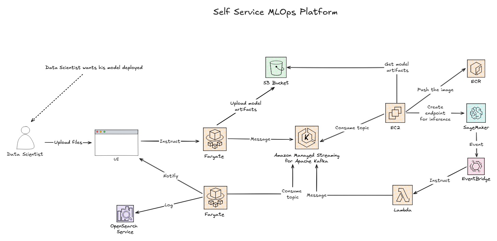

# Self service MLOps platform 

In this project, I will build a self-service MLOps platform that enables data scientists to seamlessly deploy their machine-learning models for inference. The design below demonstrates how this can be achieved using AWS services; in practice, I will implement the solution with open-source technologies that provide equivalent capabilities.



### Deploy managed kubernetes cluster

```bash
cd terraform/k8s
terraform init
terraform apply --auto-approve
```


### Deploy helm charts

#### Kafka

Edit the `helm-charts/kafka/values.yaml` file to add your desired topics under the `provisioning.topics`,  section.

```bash
cd helm-charts/kafka
helm upgrade --install -n kafka kafka ./kafka -f ./kafka/values.yaml --create-namespace
```

